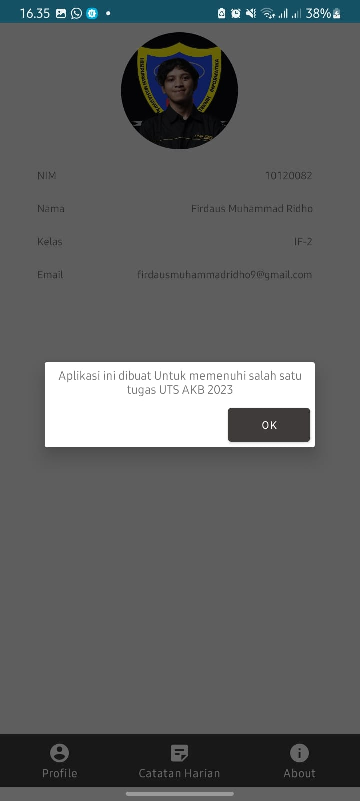
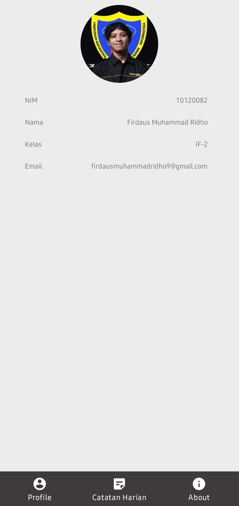
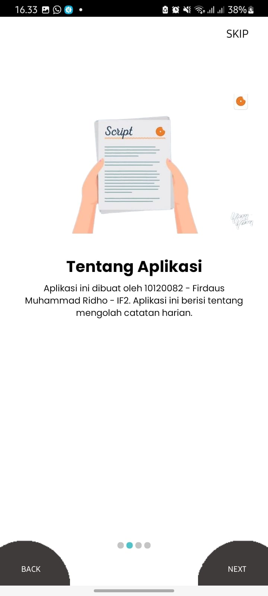

# 10120082-project-notes-app

NIM   : 10120082
Nama  : Firdaus Muhammad Ridho
Kelas : IF-2

Project Notes Application ini dibuat untuk memenuhi salah satu tugas mata kuliah
"Aplikasi Komputasi Bergerak" yaitu dengan membuat Aplikasi Notes  sederhana
dengan menggunakan Android Studio

#Preview

    

    

    

    

    

    

    

    

    

    

